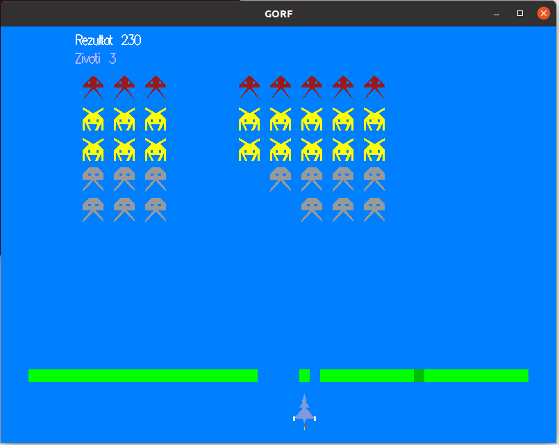
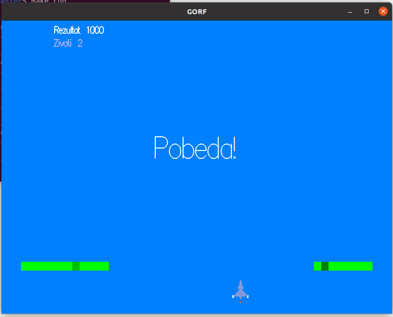
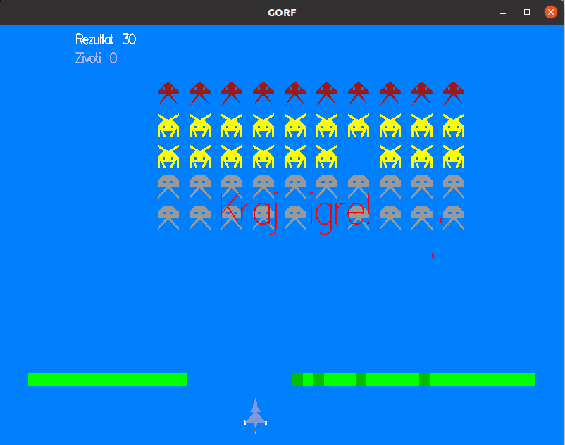

# Аркадна игрица Gorf

## Компајлирање и покретање игре

За покретање игре користити команде:

```bash
# За компајлирање кода
$ make

# За покретање игре
$ make pokreni
```
## Правила и приказ игре

Циљ игре јесте уништити све непријатељске нападаче, тада играч добија максималан број поена који износи 1000. Играч има 3 живота, уколико изгуби све животе, игра се прекида.
Отежавајућа околност јесте линија одбране између играча и нападача, та линија се брише сваком ракетом која је погоди, то јест, линију одбране уништавају и ракете играча и ракете нападача. У горњем левом углу се налазе подаци о оствареним поенима и броју живота које играч има.

### Приказ игре 



Када играч успешно уништи све нападаче игра се завршава и на екрану играч добија поруку да је победио.



Када играч изгуби све животе игра се прекида и на екрану се исписује порука да је игра завршена.



Аркадна игрица Gorf, написана у програмском језику C++, помоћу OpenGL библиотеке.
Glut односно OpenGL Utility Toolkit је библиотека која пружа услуге за коришћење OpenGL програма који углавном извршава системски ниво улазно-излазних позива са оперативним системом. Међу тим функцијама се налазе манипулације прозора програма, контрола прозора као и надгледање улазних параметара са тастатуре и миша. Све GLUT функције почињу са префиксом glut.

Поред библиотеке OpenGL, коришћене су и библиотеке:

- math.h
- vector.h
- time.h
